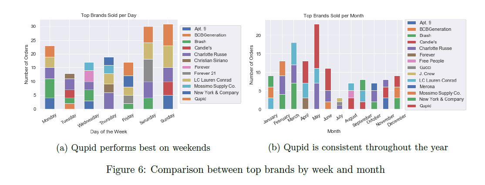

# Poshmark Sales Report Analysis

The project investigated sales data between December 2015 to December 2019 from a boutique seller on Poshmark.

The seller in this analysis had two main propositions: 
1. Find items have the highest profits in the shortest mount of waiting time (i.e. the difference between listing date and order date)
2. Compare top selling brands per day/month.

  

## Highlight

* A logistic regression is used to classify whether a merchandise will receive an offer based key features such as the item's brand, order price, and purchasing location based on the seller's domestic state.
* Classified merchandises that will receive offers from buyers with **81% accuracy**.
